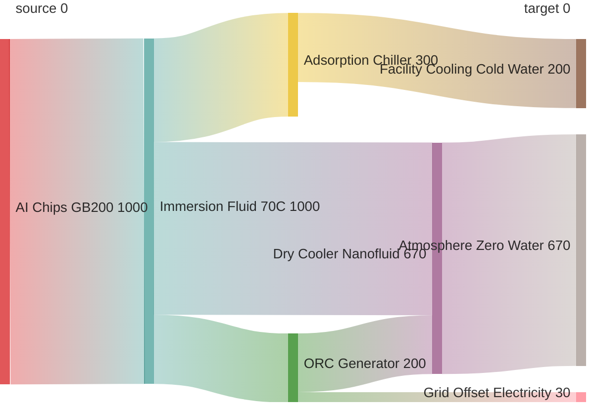
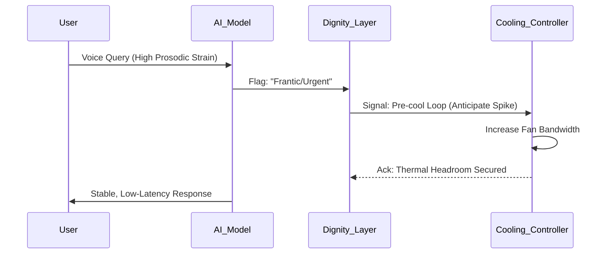

# Zero-Water AI Data Centers: Cooling Without the Crisis

**Version:** 1.1 • **License:** MIT • **Status:** Active Blueprint • **Target:** 2030 Net-Zero


---

## 🌍 Why This Exists

By 2030, AI data centers are projected to withdraw **4.2–6.6 billion m³** of freshwater annually — equivalent to the domestic water use of entire countries.

A single large hyperscaler already consumes **5 million gallons per day** through evaporative cooling.

This repository replaces that dead-end paradigm with a fully **closed-loop, zero-net-water architecture** that turns waste heat into a resource instead of a liability.

---

## 🛠 The Stack (2025-Ready)

| Layer | Technology | Outcome |
|-------|------------|---------|
| **Capture** | Direct-to-chip two-phase immersion | 70–90°C high-grade heat capture |
| **Recycle** | ORC + Adsorption Chillers | 10–20% electricity recovery + free cooling |
| **Reject** | Nanofluid-enhanced dry coolers | 100% waterless heat rejection |
| **Control** | Dignity Layer (prosody-aware) | Predictive, graceful thermal response |

**Result:** PUE ≈ 1.05–1.1 • ROI 3–9 years

---

## 📊 Feasibility Matrix

| Stack Layer | Water Savings | Power Efficiency | TRL (2025) | Cost Delta | Assessment |
|-------------|---------------|------------------|------------|------------|------------|
| Closed-Loop Immersion | **100%** (Zero Evap) | +20% (Heat Reuse) | 9 (Live) | -10% OpEx | The non-negotiable baseline |
| Seawater Proxy | 95% | +18% | 7 (Pilots) | -5% | Viable for coastal edge |
| Nanofluid Dry Coolers | 100% | +15% (vs Std Air) | 6 | +15% CapEx | Critical for hot climates |
| Bio-Transpiration | 98% (Passive) | +10% | 4 (R&D) | Unknown | High risk, high reward |

---

## 📁 Repository Structure

```
zero-water-ai-dc/
├── README.md
├── LICENSE
├── CONTRIBUTING.md
├── 01_Overview.md          # Tech stack & feasibility details
├── 02_Blueprint.md         # Nanofluid controller code
├── 03_Ethics_Risks.md      # Risk mitigations & ethical framework
├── requirements.txt
├── .gitignore
└── simulations/
    └── sim_heat_transfer.py
```

---

## 🔄 System Architecture

### Zero-Water Thermal Flow



### The "Dignity Layer" (Adaptive Load Prediction)



---

## ⚡ Key Innovation: The Dignity Layer

Traditional cooling reacts to heat after it's generated. The Dignity Layer **anticipates** thermal load by reading signals from the AI system itself:

- **Prosody signals** from voice interactions indicate user urgency
- **Query complexity** metrics predict computational intensity
- **Grace Protocol** engages when thermal limits approach — throttling gracefully rather than crashing

```python
# From 02_Blueprint.md
if predicted_heat > max_rejection:
    return {
        "status": "THROTTLED",
        "action": "Engage_Grace_Protocol",
        "msg": "Internal heat limit approached. Prioritizing inference stability."
    }
```

---

## 🛡 Ethics & Risk Mitigations

| Risk | Mitigation |
|------|------------|
| **Vulnerable Grid Trap** — Dry cooling spikes electrical load in water-scarce regions | Bidirectional guardrails: Auto "Eco-Mode" if local grid is stressed |
| **Prosody False Positives** — Misreading voice strain wastes fan power | Private scratchpads: System learns user baselines over time |
| **Coastal Bias** — Seawater loops only benefit rich coastal areas | Modular forks: Separate branches for `air_cooled_hybrid` and `seawater_proxy` |

> *"Sustainability is not just about the planet; it's about the dignity of the access we provide."*

---

## 🚀 Quickstart

### 1. Install Dependencies

```bash
pip install -r requirements.txt
```

### 2. Run the Feasibility Simulation

```bash
python simulations/sim_heat_transfer.py
```

**Sample Output:**
```
--- 2025 AI Cluster Water Usage Sim ---
Cluster Size: 1000 GPUs (700kW Load)
Traditional Water Use: 30,240 Liters/Day
Zero-Water Architecture Use: 0 Liters/Day
---
Daily Savings: 100.0%
Annual Water Saved: 11.04 Million Liters
```

---

## 🧠 Collaboration Credits

A cross-AI technical collaboration between **Zee/Leena Thomas** and:

| AI System | Contribution |
|-----------|--------------|
| **Grok** (xAI) | Real-time simulation & parameters |
| **Gemini** (Google) | Nanofluid dynamics & techno-economic modeling |
| **Claude** (Anthropic) | Ethics guardrails & control logic |
| **ChatGPT** (OpenAI) | Synthesis & repository structure |


---

## 📄 License

This project is licensed under the **MIT License** — see the [LICENSE](LICENSE) file for details.

---

## 🤝 Contributing

Contributions welcome! Please read [CONTRIBUTING.md](CONTRIBUTING.md) for guidelines.

**Priority areas:**
- Regional adaptation guides (inland vs coastal)
- Additional simulation scenarios
- Real-world pilot documentation

---

<p align="center">
  <i>Turning waste heat into a resource. One data center at a time.</i>
</p>

---

## Related Work

This repository explores closed-loop thermal management for AI infrastructure—treating heat as a first-class system output.

**For a complete catalog of related research:**  
📂 [AI Safety & Systems Architecture Research Index](https://github.com/leenathomas01/research-index)

**Thematically related:**
- [ZPRE-6G](https://github.com/leenathomas01/ZPRE-Implementation-6G) — Bio-inspired optimization for telecommunications
- [Connector OS](https://github.com/leenathomas01/connector-os-trenchcoat) — Control-theoretic architecture


---
